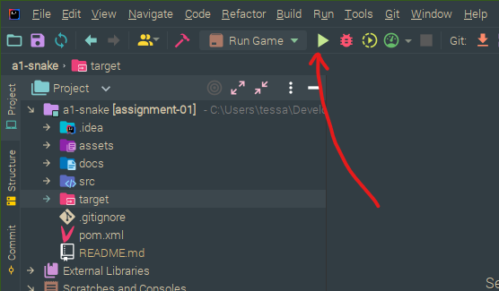

# `snek!`

A simple remake of the classic game Snake, built in Java.

## Requirements

- Java SE 17 or above
- IntelliJ (or Maven for command-line-only builds)

---

## How to run `snek!`

### Run with IntelliJ

If you are using IntelliJ, you can use the pre-existing run configuration "Run Game":



### Run from Commandline

Or to build from the command-line only, you can use Maven, if you have it installed, and then run the `.JAR` directly:

```shell
mvn package
java -jar target/snek.jar
```

---

## Playing `snek!`

A window should appear for you to play the game:


The rules are simple:

- Use the arrow keys to move snek around the world
- Eat the apples, but watch out for the poisonous ones! 
- Try not to hit the wall or your tail, or it's game over

### `snek!` Features

- Main menu that lets the playerNumber select the game mode
- Infinite mode: let the snake tail grow forever
- Avoid poisonous apples or lose a life!
- H.U.D. shows the playerNumber(s) apple count and lives remaining
- DOOM-inspired H.U.D. avatar that responds when the playerNumber eats an apple
- In-game pause function
- Watch out for cool sound effects:
  - Satisfying crunch when an apple is eaten
  - Disgusted noise when a poisonous apple is eaten
  - Death scream when the playerNumber loses the game
  - Menu navigation and selection
- Epic music to set the scene during gameplay
- Game over screen that lets the playerNumber play again or go to the main menu
- Two playerNumber mode: play against a blue friend, fight for the highest score!


### Future Improvements

- Track high-scores and high-score submenu in the main menu
- Player Two Blue H.U.D. Avatar
- Randomly placed obstacles, like rocks
- Infinite-walls mode: go through walls and appear on the opposite side
- Power-ups, like extra lives, or to make snek faster

---

## Architecture

### Overview

`snek` was developed with the minimum version of OpenJDK 17, and uses Maven to build and package the `.JAR`.
The game engine used to develop Snek is my external `TEngine` project, which has been included locally to simplify
the build process.

### Project Overview and Maven

The project is organised to work with the Maven build system—you can find all the source code in `./src/main/java/`.

Within the source files, there are the following packages:


### `TEngine`


### Class Diagram for `snek!`


### State Machine Diagram for Screen Transitions


### Deployment Diagram?


## TODO:

- Update the maven reference to the game engine once the game engine has been duplicated into this assignment

## Attributions

- [Animated Snake by Calciumtrice](https://opengameart.org/content/animated-snake), Creative Commons Attribution 3.0 license.
- [Retro Gaming Font by Daymarius](https://www.dafont.com/retro-gaming.font), free for personal and commercial use.
- [Music by Steven Melin](https://stevenmelin.com), free for personal and commercial use.
- [Sound Effects by Juhani Junkala](https://juhanijunkala.com/), free for personal and commercial use.
