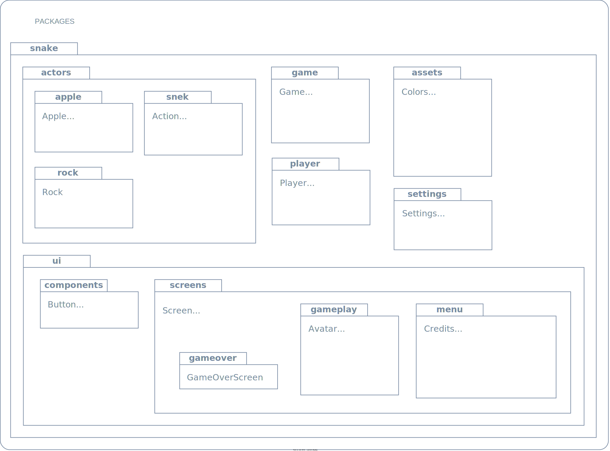

# `snek!` 

[](https://github.com/tessapower/snek/actions/workflows/maven-build.yml) 
[](https://github.com/tessapower/snek/actions/workflows/javadoc.yml)

[→ Documentation](https://tessapower.github.io/snek)

A simple remake of the classic game Snake (with a few flourishes!) using my own 2D game
engine, [TEngine](https://github.com/tessapower/tengine).

> **Note**
>
> This was my very first game, and looking back on it now, there are a lot of improvements I'd make.
> The architecture is slightly more reminiscent of a GUI library than what you would expect from a
> game engine. In any case, here it is preserved for the sake of nostalgia! :)

## Requirements

- Minimum Java SE 17+
- IntelliJ, Eclipse, or your favourite Java editor
- Maven (install locally for command-line-only builds)

## How to run `snek!`

This project uses the Maven build system. My editor of choice is IntelliJ, so there is a ready-made
run configuration included in this project called "Run Game". If your editor supports
Maven, you can run the `install` goal and launch the `snek.jar` found in `snake/target`
directory. Otherwise, you can build and run the game from the command line.

Building the project from the command line requires you to have Maven installed locally, so `brew
install maven` or `choco install maven` or however you need to with your package manager of choice.

Then enter the following commands from the project root:

```shell
# install dependencies and build
mvn install
# run the game
java -jar snake/target/snek.jar
```

## How to play `snek!`

Snake is a bit of a rite of passage, so we all know the rules. Use the arrow keys (or W-A-S-D if
you are player two), to move around the world. Eat the apples, try not to crash into stuff, don't
hit your own tail, etc.

https://user-images.githubusercontent.com/25911223/206885403-cf983a9c-0557-4816-bd44-db15b6a3cfe9.mp4

## Architecture

### Overview

`snek!` was developed with the minimum version of Java 17, and uses Maven to build the project
including its dependencies, and package it into an executable `.JAR`. The project is organised to
work with the Maven build system—you'll find all the source code in `snake/src/main/java/`.

### `TEngine`

The game engine used to develop `snek!` is my very own (and very first) game engine, called
`TEngine`! You can find out more about it [here](https://github.com/tessapower/tengine). The version
used at the time has been included locally as a module to simplify the build process.

### The `snek!` Game Actor

The star of the show is `snek`, of course! As the `TEngine` uses ECS to model Actors, the `snek`
Actor is also structured this way—we separate out the logic from the graphical representation, and
this decoupled structure offers more flexibility throughout development. The graphical
representation is further broken down into two separate components, the head and the tail. The
logical representation is also further separated out and encapsulated in the Player class, which
you can see in the class diagram below:


This makes it quite easy to have each aspect of the `Snek` Actor manage itself and update its different components
separately.

The `Snek` Actor largely manages itself, including growing its tail as necessary, rotating its head to face the right
direction, and handling key events. The only parts that need to be coordinated from the outside are responding to
collisions and needing to be told to eat an apple. A higher level `GameWorld` manages the interactions between the actors.

### The `GameWorld`

The `GameWorld` coordinates the gameplay, which is grid based, and manages the interactions between actors depending on
the game configuration (one or two player, infinite or normal mode).


On a given tick, the `GameWorld` will check if the `Snek` actors have collided with the walls, with themselves,
or with each other. It then checks if an `Apple` has been eaten, and passes that to the appropriate `snek` player,
which will know what to do with it. The `GameWorld` will then organise removing the `Apple` from the world,
and placing a new one at a random location. We can see this interaction fleshed out below:


### Screen Management

At a higher level than the `GameWorld` is the `PlayGameScreen`, which is, as the name suggests, the screen that is
loaded when the user starts playing the game. We also have the `MenuScreen`, which internally is made up of
smaller `Menu`s, and the `GameOverScreen`. To manage moving between all of these screens at a higher level, we have the
`Game` class, which extends the `TEngine` game engine, and is the entry point for the program. The `Game` is where we
initially set up everything needed for `Snek`, and then it manages loading and unloading each of these screens. It then
listens for callbacks from each screen to know when to transition and which screen to load next.


The first screen loaded is the `MenuScreen`, which lets the player select the game configuration and makes
that available to the `PlayGameScreen` through `Settings`. While the `PlayGameScreen` is loaded, it updates the
`GameState` so that when the game is over and the `GameOverScreen` is loaded, it can be passed the `GameState` and
display the results.

### Package Diagram

There are lots of things I didn't cover, so here's an overview of the packages and classes in 
`snek!`:



## Attributions

- [Animated Snake by Calciumtrice](https://opengameart.org/content/animated-snake), Creative Commons Attribution 3.0 license.
- [Retro Gaming Font by Daymarius](https://www.dafont.com/retro-gaming.font), free for personal and commercial use.
- [Music by Steven Melin](https://stevenmelin.com), free for personal and commercial use.
- [Sound Effects by Juhani Junkala](https://juhanijunkala.com/), free for personal and commercial use.

## License

This project is licensed under the [MIT license](https://github.com/tessapower/snek/blob/main/LICENSE).

### Contribution

Unless you explicitly state otherwise, any contribution intentionally submitted for inclusion in 
this repository by you, shall be licensed as MIT, without any additional terms or conditions.
