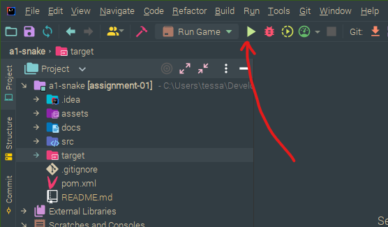

# `snek!`

A simple remake of the classic game Snake, built in Java.

## Requirements

- Java SE 17 or above
- IntelliJ (or Maven for commandline-only builds)

## How to run `snek!`

### Run with IntelliJ

If you are using IntelliJ, you can use the pre-existing run configuration "Run Game":



### Run from Commandline

Or to build from the commandline only, you can use Maven, if you have it installed, and then run the `.JAR` directly:

```shell
mvn package
java -jar target/snek.jar
```

## Playing `snek!`

A window should appear for you to play the game!


The rules are simple:

- Use the arrow keys to move snek around the world.
- Eat the apples, but only the good ones!
- Try not to hit the wall or your tail, or it's game over.

## Architecture

### Overview

`snek` was developed with the minimum version of OpenJDK 17, and uses Maven to build and package the `.JAR`.
The game engine used to develop Snek is my external `TEngine` project, which has been included locally to simplify
the build process.

### Project Overview and Maven


### `TEngine`


### Package Diagram for `snek!` Project


### Class Diagram for `snek!`


### State Machine Diagram for Screen Transitions


### Deployment Diagram?


## TODO:

- Update the maven reference to the game engine once the game engine has been duplicated into this assignment

## Attributions

- [Animated Snake by Calciumtrice](https://opengameart.org/content/animated-snake), Creative Commons Attribution 3.0 license.
- [Retro Gaming Font by Daymarius](https://www.dafont.com/retro-gaming.font), free for personal and commercial use.
